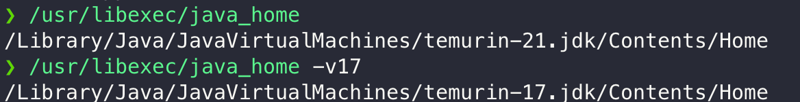
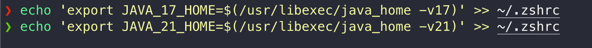
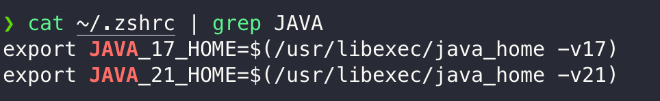
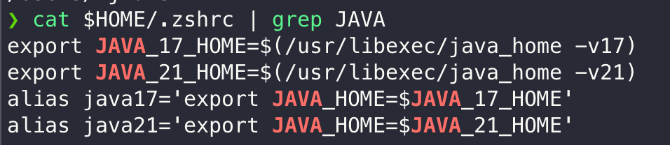
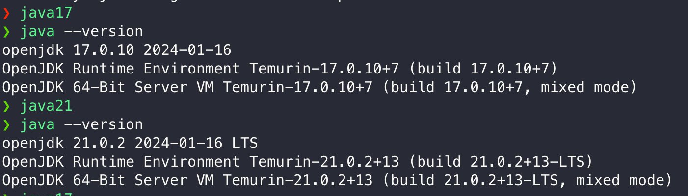

# prerequisite
- macos (OSX) 
- homebrew 설치가 된 상태
- 여러버전의 jdk가 설치
- zsh를 사용 (OSX 기본 shell)

# 여러 버전의 자바가 설치되었을 경우

#### jdk가 설치된 경로 확인
```shell
/usr/libexec/java_home
/usr/libexec/java_home -v17
/usr/libexec/java_home -v20 # sample
/usr/libexec/java_home -v21 
```
> jdk설치 경로 확인 (설치 환경에 따라서 출력의 결과는 그림과 다를수 있음)

 
#### 자바 버전별로 환경 변수 (Environment Variables) 만들어서 시스템에 적용하기

```shell
# echo는 쉘에서 값을 문자열을 출력하는 기능을 한다. 
# export는 환경변수를 셋팅하는 역할을 한다.
# >> 은 쉘에 출력된 문자열을 >> 기호 다음에 나오는 파일의 제일 끝에 추가한다
# ~ 은 현재 내 경로를 의미하는 약어이다 (== $HOME)
echo $HOME

echo 'export JAVA_17_HOME=$(/usr/libexec/java_home -v17)' >> ~/.zshrc
echo 'export JAVA_21_HOME=$(/usr/libexec/java_home -v21)' >> ~/.zshrc

# 파일에 제대로 적혀있는지 확인
# cat: 파일의 내용을 보여주는 명령어
# | : 앞의 출력결과를 뒷부분 명령어에 전달해주는 역할
# grep : grep 뒤에 적히는 문자열을 찾는 명령어
cat ~/.zshrc | grep JAVA
```
 
> 자바 환경변수 설정 하기
  

> 환경 변수 셋팅후 ~/.zshrc 파일 확인


#### alias 명령어를 이용해서 JAVA_HOME 환경변수 쉽게 변경할 수 있도록 셋팅

* alias는 내가 원하는 문자열로 명령어를 실행할수 있게 해주는 명령어
* 복잡한 설정이 있는 명령어를 축약해서 내가 실행하기 편하게 한다

```shell
echo "alias java17='export JAVA_HOME=\$JAVA_17_HOME'" >> ~/.zshrc
echo "alias java21='export JAVA_HOME=\$JAVA_21_HOME'" >> ~/.zshrc
```
  

> ~/.zshrc 파일확인

  
  
- source 명령어로 .zshrc에 적힌 내용을 시스템에 적용

    * source 명령어 안쓰고 터미널을 껐다 켜도 된다.
```shell
# source 명령어는 파일의 내용을 적용한다.
source ~/.zshrc
```

#### 터미널에 java17과 java21을 입력하면 자유롭게 버전을 변경 가능
```shell
java17
java --vesrion
java21 
java --version
```
>자바 버전 확인 결과

