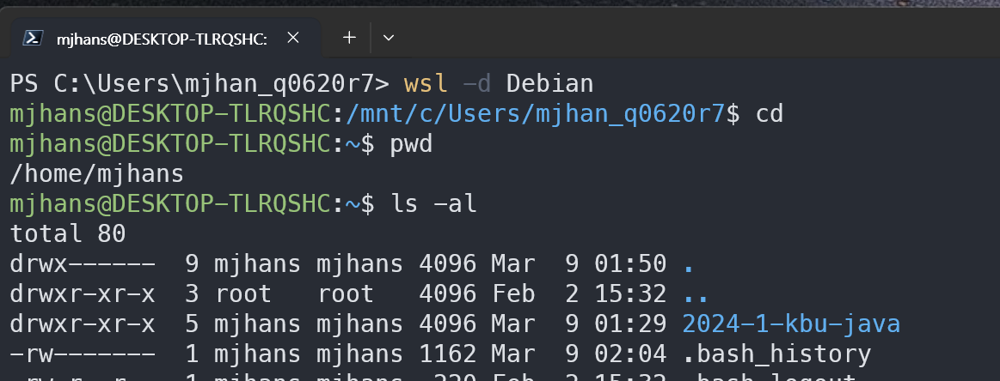

# 설치된 JDK를 이용해서 컴파일하고 실행하기
---
## prerequisite
* windows 10 (Build 19041 이상)
* WSL을 이용해서 Debian Linux 정상 설치
* Debian Linux에 JDK 1.17 정상 설치

## hello world 출력방법

### 참고사항
- wsl을 통해서 윈도우가 아닌 리눅스환경에 설치 했기 때문에 윈도우 환경에서 자바 사용 불가 
- 작업하기 편리한 윈도우즈에서 코드를 작성하고, debian linux영역으로 파일을 이동해서 컴파일 및 실행 하는 방법을 쓴다

> **WSL2 구조**
> 
>  
> 
> 이미지 출처 : https://heekangpark.github.io/wsl/wsl
> 
> **hypervisor** : 단일 물리적 머신에서 여러 가상머신을 실행한는데 사용할수 있는 소프트웨어 [참고링크](https://aws.amazon.com/ko/what-is/hypervisor/)
>
> **Kernel** : 운영체제 중 항상 메모리에 올라가 있는 운영체제의 핵심 부분으로써 하드웨어와 응용 프로그램 사이에서 인터페이스를 제공하는 역할을 하며 컴퓨터 자원들을 관리하는 역할 [참고링크](https://minkwon4.tistory.com/295)
>
> **Usermode(system program)** : kernel은 컴퓨터 자원관리만 하므로 사용자(휴먼)과 상호작용 (interaction)을 하지 않는다. 커널과 사용자간 상호작용을 지원하는 구현체를 지칭한다. 예시)bash, zsh, PowerShell 등등

### 작업 순서
1. 윈도우즈에서 메모장을 이용해서 자바 코드 작성하기
2. Debian Linux의 디렉토리로 만들어둔 코드 복사하기
3. Debian Linux 접속하기
4. javac 명령어로 코드 컴파일하고, java 명령어로 실행하기

### Hello World 출력

#### 윈도우즈에서 샘플코드 작성
- 윈도우즈에서 메모장을 실행해서 아래의 코드 쓰기
```java
class HelloWorld {
    public static void main(String[] args) {
        System.out.println("Hello World!");
    }
}
```

- 파일이름을 `HelloWorld.java` 로 저장
  - 아래 그림의 경우 바탕화면에 저장


#### 윈도우즈에서 작성한 소스코드를 debian으로 이동하기
- 저장한 파일을 Debian 리눅스와 연결된 디렉토리로 이동
  - 파일 탐색기에서 Debian 리눅스 디렉토리 찾기

 

  - HelloWorld.java파일을 Debian  복사하기


> 참고사항 : Debian linux의 경우 경로가 /mnt/c/ 로 잡혀있다 윈도우즈 C 드라이브와 연결된부분
> 

#### 리눅스 접속하기
- powershell을 열고 `wsl -d Debian` 명령어로 리눅스 접속하기



#### jdk 버전 확인
- jdk 1.17이 제대로 설치됬는지, 확인
  - `java --version`  


#### 컴파일 하기

- Debian linux에서 소스코드 파일 확인하고, javac 명령어로 컴파일하기

```shell
# cd 명령어로 파일을 저장한 곳까지 이동하기
# cd path/to/file 
# 이 문서의 경우 /home/mjhans/ 경로에 저장
javac HelloWorld.java
# 파일 목록 확인
ls -al
``` 


#### 실행하기
- HelloWorld 클래스를 컴파일 했기 때문에 HelloWorld.class 파일이 생성됨
- 실행할때는 파일 전체 이름이 아닌, 클래스 이름을 사용
```shell
java HelloWorld
```


